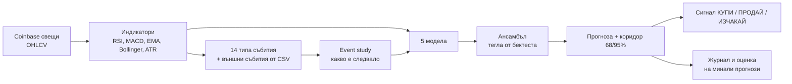

# Крипто прогнозен бот

Бот, който изтегля историческите свещи от Coinbase, разпознава пазарни събития в миналото,
измерва какво се е случвало след тях и прогнозира следващата свещ: вероятност за ръст,
очаквана цена и ценови коридор. Всяка прогноза минава през walk-forward проверка, а ботът
казва открито, когато моделите нямат доказано предимство.

> Това е статистически инструмент, а не финансов съвет. Ботът **не** търгува сам.

## Как работи



1. **Данни** – публичното API на Coinbase (без API ключ), с локален CSV кеш и инкрементално
   обновяване. Незатворената последна свещ се изхвърля автоматично.
2. **Събития** – всяка свещ се проверява за 14 събития: скок в обема, силен ръст/спад (>2σ),
   golden/death cross, RSI над 70 / под 30, пробив на 20-периоден максимум/минимум, MACD
   пресичания, свиване на Bollinger лентите, 3 поредни зелени/червени свещи. Може да добавиш и
   външни събития (заседания на Фед, халвинг, решения за ETF) чрез CSV файл.
3. **Event study** – за всяко събитие: колко пъти се е случило, колко често цената е била
   по-висока след него, средна доходност и t-статистика.
4. **Модели** (всеки дава вероятност за ръст и очаквана доходност):
   - *Статистика на минали събития* – байесова оценка на успеваемостта след активните събития;
   - *Исторически аналози (k-NN)* – търси най-сходните минали ситуации и гледа какво е последвало;
   - *Марковска верига* – преходи между режими „спад / странично / ръст“;
   - *Логистична регресия* и *gradient boosting* върху ~40 признака.
5. **Ансамбъл** – теглата идват от точността на всеки модел в бектеста.
6. **Коридор** – EWMA волатилност, калибрирана с реалните минали отклонения (дебели опашки).
7. **Предпазител** – ако ансамбълът не бие монета в walk-forward теста (Brier skill ≤ 0 или
   AUC ≤ 0.5), сигналът е винаги „ИЗЧАКАЙ“ и прогнозата за посока е само информативна.

## Инсталация

```bash
pip install -r requirements.txt      # numpy, pandas, scikit-learn, requests
# или: pip install -e ".[dev]"  → дава и команда `crypto-bot`
```

## Употреба

```bash
# Прогноза за BTC-USD, дневни свещи (изтегля 2 години история при първото пускане)
python -m crypto_bot predict

# Друг актив, часови свещи, прогноза 4 часа напред + HTML табло + журнал
python -m crypto_bot predict --product ETH-USD --granularity 1h --horizon 4 \
    --html reports/eth.html --log predictions_log.csv

# Без интернет – с приложените реални данни от Coinbase и заседанията на Фед
python -m crypto_bot predict --csv data/BTC-USD_1d.csv --events-file data/events_fomc.csv \
    --html reports/dashboard.html

python -m crypto_bot events   --csv data/BTC-USD_1d.csv   # какво е следвало след всяко събитие
python -m crypto_bot backtest --csv data/BTC-USD_1d.csv --horizon 3
python -m crypto_bot fetch    --product SOL-USD --granularity 6h --days 365
python -m crypto_bot evaluate --log predictions_log.csv    # колко точни са били минали прогнози
python -m crypto_bot watch    --granularity 1h --interval 3600 --html reports/live.html
```

Основни опции: `--product`, `--granularity {1m,5m,15m,1h,6h,1d}`, `--horizon N`,
`--events-file`, `--threshold 0.02` (отстъп от 50% за сигнал), `--fee 0.001`,
`--allow-short`, `--no-backtest` (по-бързо), `--json`.

### Външни събития

CSV с колони `date,name` (UTC). Всяко събитие се отбелязва върху свещта, в която попада, и
влиза в event study-то и моделите. Събитие в бъдещия прогнозен прозорец се показва като
предупреждение за по-висока волатилност.

```csv
date,name
2026-10-28T18:00:00Z,FOMC decision
```

`data/events_fomc.csv` съдържа решенията на FOMC от ноември 2024 до декември 2026 по
официалния календар на federalreserve.gov (обявяване в 14:00 ч. източно време).

## Резултати върху реални данни (честно)

Приложените данни: `data/BTC-USD_1d.csv` – 700 дневни свещи BTC-USD от Coinbase
(25.10.2024 – 24.09.2026). Walk-forward тест за прогноза 1 ден напред, 499 прогнози
(12.05.2025 – 22.09.2026):

| Модел | Точност | Brier (0,25 = монета) | AUC |
|---|---:|---:|---:|
| Статистика на минали събития | 51,3% | 0,2524 | 0,499 |
| Исторически аналози (k-NN) | 47,9% | 0,2573 | 0,500 |
| Марковска верига | 48,9% | 0,2542 | 0,489 |
| Логистична регресия | 44,3% | 0,2598 | 0,436 |
| Gradient boosting | 47,7% | 0,2596 | 0,473 |
| **Ансамбъл** | **45,1%** | **0,2537** | **0,462** |
| „Винаги нагоре“ | 49,3% | – | – |

**Изводът:** посоката на дневната цена на BTC от технически данни на практика не се
предсказва – нито един модел не бие монетата устойчиво (същото е за 3 и 7 дни напред).
Затова ботът в момента дава „ИЗЧАКАЙ“. Като проверка, върху синтетични данни със скрита
закономерност (авторегресия 0,35–0,4) същите модели я откриват с 54–58% точност, така че
липсата на предимство идва от пазара, а не от бъг.

**Кое работи:** коридорът на волатилността. В 598 walk-forward прогнози цената е попаднала
в 68%-ния коридор в **69,1%** от случаите и в 95%-ния в **93,6%**. Колко силно ще се движи
цената се предсказва много по-добре от посоката.

## Структура

```
crypto_bot/
  data.py        Coinbase клиент, CSV кеш, изхвърляне на незатворена свещ
  indicators.py  RSI, EMA, MACD, Bollinger, ATR, z-score (всички каузални)
  events.py      детекция на събития, външни събития, event study
  features.py    признаци и цел (без изтичане на бъдещи данни)
  models.py      5-те модела и ансамбълът
  backtest.py    walk-forward тест, метрики, симулация на стратегия с такси
  volatility.py  EWMA волатилност, калибриран коридор, проверка на покритието
  bot.py         оркестрация: данни → модели → прогноза → сигнал
  journal.py     журнал на прогнозите и оценка спрямо реалността
  report.py      текст, JSON и HTML табло
  cli.py         команди fetch / events / backtest / predict / evaluate / watch
data/            реални свещи от Coinbase и календар на FOMC
tests/           38 теста (pytest)
```

## Тестове

```bash
pip install pytest && python -m pytest
```

Тестовете проверяват, че индикаторите и признаците не „надничат“ в бъдещето, че
walk-forward тестът не обучава с бъдещи данни, математиката на стратегията, пагинацията на
Coinbase клиента (с фалшива сесия), калибрацията на коридора и целия цикъл на бота.
