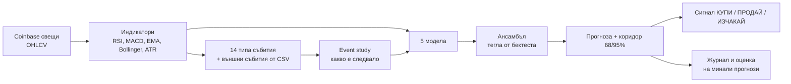

# Крипто прогнозен бот

Бот, който изтегля историческите свещи от Coinbase, разпознава пазарни събития в миналото,
измерва какво се е случвало след тях и прогнозира следващата свещ: вероятност за ръст,
очаквана цена и ценови коридор. Всяка прогноза минава през walk-forward проверка, а ботът
казва открито, когато моделите нямат доказано предимство.

> Това е статистически инструмент, а не финансов съвет. Ботът **не** търгува сам.

## Как работи



1. **Данни** – публичното API на Coinbase (без API ключ), с локален CSV кеш и инкрементално
   обновяване. Незатворената последна свещ се изхвърля автоматично.
2. **Събития** – всяка свещ се проверява за 14 събития: скок в обема, силен ръст/спад (>2σ),
   golden/death cross, RSI над 70 / под 30, пробив на 20-периоден максимум/минимум, MACD
   пресичания, свиване на Bollinger лентите, 3 поредни зелени/червени свещи. Може да добавиш и
   външни събития (заседания на Фед, халвинг, решения за ETF) чрез CSV файл.
3. **Event study** – за всяко събитие: колко пъти се е случило, колко често цената е била
   по-висока след него, средна доходност и t-статистика.
4. **Модели** (всеки дава вероятност за ръст и очаквана доходност):
   - *Статистика на минали събития* – байесова оценка на успеваемостта след активните събития;
   - *Исторически аналози (k-NN)* – търси най-сходните минали ситуации и гледа какво е последвало;
   - *Марковска верига* – преходи между режими „спад / странично / ръст“;
   - *Логистична регресия* и *gradient boosting* върху ~40 признака.
5. **Ансамбъл** – теглата идват от точността на всеки модел в бектеста.
6. **Коридор** – EWMA волатилност, калибрирана с реалните минали отклонения (дебели опашки).
7. **Предпазител** – ако ансамбълът не бие монета в walk-forward теста (Brier skill ≤ 0 или
   AUC ≤ 0.5), сигналът е винаги „ИЗЧАКАЙ“ и прогнозата за посока е само информативна.

## Инсталация

```bash
pip install -r requirements.txt      # numpy, pandas, scikit-learn, requests
# или: pip install -e ".[dev]"  → дава и команда `crypto-bot`
```

## Употреба

```bash
# Прогноза за всички от watchlist.txt (56 криптовалути), дневни свещи + HTML табло
python -m crypto_bot predict --html reports/dashboard.html

# Всички активни USD двойки в Coinbase, без филтър
python -m crypto_bot predict --product all

# Само няколко актива, часови свещи, прогноза 4 часа напред + журнал
python -m crypto_bot predict --product ETH-USD,SOL-USD --granularity 1h --horizon 4 --log predictions_log.csv

# Без интернет – с приложените реални данни от Coinbase и заседанията на Фед
python -m crypto_bot predict --offline --product BTC-USD,ETH-USD,SOL-USD \
    --events-file data/events_fomc.csv --html reports/dashboard.html

python -m crypto_bot fetch                                  # изтегли/обнови данните за целия списък
python -m crypto_bot events   --offline --product SOL-USD   # какво е следвало след всяко събитие
python -m crypto_bot backtest --horizon 3                   # walk-forward проверка за целия списък
python -m crypto_bot evaluate --log predictions_log.csv     # колко точни са били минали прогнози
python -m crypto_bot watch    --granularity 1h --interval 3600 --html reports/live.html
```

Основни опции: `--product` (един или няколко, разделени със запетая, или `all`; без него се
чете `--watchlist`, по подразбиране `watchlist.txt`), `--offline` (само кешираните файлове в
`--cache-dir`), `--csv ФАЙЛ` (един актив; продуктът се разпознава от име като
`ETH-USD_1d.csv`), `--jobs N` (паралелни процеси, по подразбиране според ядрата),
`--granularity {1m,5m,15m,1h,6h,1d}`, `--horizon N`, `--events-file`, `--threshold 0.02`
(отстъп от 50% за сигнал), `--fee 0.001`, `--allow-short`, `--no-backtest` (по-бързо),
`--details` (пълен отчет за всеки актив), `--json`.

С няколко актива текстовият изход е обобщена таблица, JSON изходът е
`{"assets": [...], "skipped": [...]}`, а HTML таблото има карти (до 4 актива) или таблица с
търсене и сортиране (повече активи), която превключва подробния изглед (линк към конкретен
актив: `dashboard.html#eth`). Актив без данни или с по-малко от 230 затворени свещи (нов
листинг) се пропуска с обяснение, без да спира останалите.

### Списък за следене

`watchlist.txt` съдържа 56 криптовалути: по един продукт на ред, `#` започва коментар.
Редактирай го свободно. Списъкът е съставен на 24.09.2026 така:

- всички активни спот двойки срещу USD в Coinbase (121);
- без стейбълкойни (USDT, USDC, DAI, PYUSD и др.): цената им е вързана за долара;
- оборот за 24 ч. поне $1 млн., или място в топ 100 по пазарна капитализация и оборот поне
  $250 хил.; по-слабо търгуваните двойки имат шумни свещи с дупки.

BNB, TRX, UNI, AAVE, SHIB и ETC не се търгуват срещу USD в Coinbase и затова липсват.
Пълната вселена без филтър е достъпна с `--product all`. За 56 актива с бектест на 4 ядра
прогнозата отнема около 2–3 минути, а първото изтегляне на данните – около минута.

### Външни събития

CSV с колони `date,name` (UTC). Всяко събитие се отбелязва върху свещта, в която попада, и
влиза в event study-то и моделите. Събитие в бъдещия прогнозен прозорец се показва като
предупреждение за по-висока волатилност.

```csv
date,name
2026-10-28T18:00:00Z,FOMC decision
```

`data/events_fomc.csv` съдържа решенията на FOMC от ноември 2024 до декември 2026 по
официалния календар на federalreserve.gov (обявяване в 14:00 ч. източно време).

## Резултати върху реални данни (честно)

Приложените данни в `data/` са по 700 дневни свещи от Coinbase за BTC-USD, ETH-USD и
SOL-USD (25.10.2024 – 24.09.2026). Walk-forward тест за прогноза 1 ден напред, по 499
прогнози на актив (12.05.2025 – 22.09.2026):

| Модел | BTC точност · AUC | ETH точност · AUC | SOL точност · AUC |
|---|---:|---:|---:|
| Статистика на минали събития | 51,3% · 0,499 | 45,3% · 0,435 | 50,7% · 0,491 |
| Исторически аналози (k-NN) | 47,9% · 0,500 | 51,7% · 0,511 | 48,1% · 0,491 |
| Марковска верига | 48,9% · 0,489 | 48,9% · 0,475 | 50,1% · 0,503 |
| Логистична регресия | 44,3% · 0,436 | 48,5% · 0,479 | 48,5% · 0,478 |
| Gradient boosting | 47,7% · 0,473 | 49,3% · 0,478 | 48,3% · 0,457 |
| **Ансамбъл** | **45,1% · 0,462** | **50,5% · 0,474** | **50,5% · 0,477** |
| „Винаги нагоре“ | 49,3% | 51,3% | 48,7% |
| Brier на ансамбъла (0,25 = монета) | 0,2537 | 0,2548 | 0,2529 |

**Изводът:** посоката на дневната цена от технически данни на практика не се предсказва –
нито един модел не бие монетата устойчиво при нито един от трите актива (при BTC същото е
и за 3 и 7 дни напред). Затова ботът в момента дава „ИЗЧАКАЙ“ и за трите. Предпазителят има
значение: ако сигналът за ETH се следваше сляпо, стратегията щеше да загуби 57% срещу +7,5%
при „купи и дръж“. Като проверка, върху синтетични данни със скрита закономерност
(авторегресия 0,35–0,4) същите модели я откриват с 54–58% точност, така че липсата на
предимство идва от пазара, а не от бъг.

**Кое работи:** коридорът на волатилността (598 walk-forward прогнози на актив):

| Актив | В 68%-ния коридор | В 95%-ния коридор |
|---|---:|---:|
| BTC | 69,1% | 93,6% |
| ETH | 67,9% | 95,3% |
| SOL | 66,2% | 94,8% |

Колко силно ще се движи цената се предсказва много по-добре от посоката.

## Структура

```
crypto_bot/
  data.py        Coinbase клиент, CSV кеш, изхвърляне на незатворена свещ
  indicators.py  RSI, EMA, MACD, Bollinger, ATR, z-score (всички каузални)
  events.py      детекция на събития, външни събития, event study
  features.py    признаци и цел (без изтичане на бъдещи данни)
  models.py      5-те модела и ансамбълът
  backtest.py    walk-forward тест, метрики, симулация на стратегия с такси
  volatility.py  EWMA волатилност, калибриран коридор, проверка на покритието
  bot.py         оркестрация: данни → модели → прогноза → сигнал
  journal.py     журнал на прогнозите и оценка спрямо реалността
  report.py      текст, JSON и HTML табло
  watchlist.py   списък за следене, всички USD двойки, филтър на стейбълкойни
  cli.py         команди fetch / events / backtest / predict / evaluate / watch
data/            реални свещи от Coinbase (BTC, ETH, SOL) и календар на FOMC
watchlist.txt    56-те криптовалути, които ботът следи по подразбиране
tests/           49 теста (pytest)
```

## Тестове

```bash
pip install pytest && python -m pytest
```

Тестовете проверяват, че индикаторите и признаците не „надничат“ в бъдещето, че
walk-forward тестът не обучава с бъдещи данни, математиката на стратегията, пагинацията на
Coinbase клиента (с фалшива сесия), калибрацията на коридора и целия цикъл на бота.
